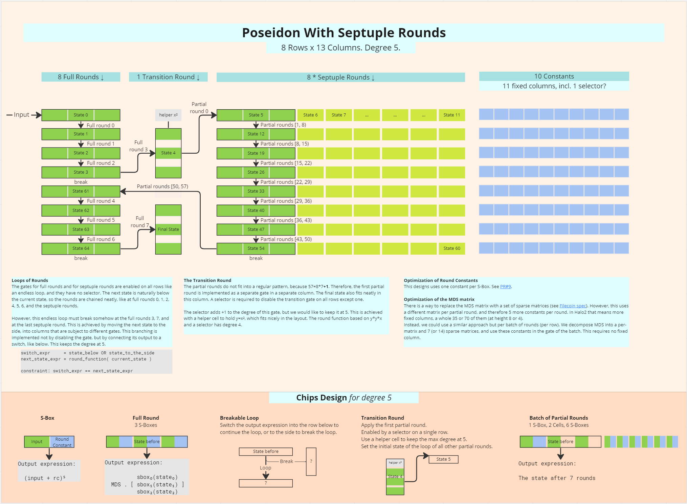

# A Poseidon Chip with Septuple Rounds

This is a circuit for a Poseidon permutation. It uses 8 rows per permutation. It exposes pairs of input/output at fixed
locations, to use with a sponge circuit. It is designed as a set of chips, that can be rearranged to obtain 4, 2, or
even 1 rows per permutation. It can potentially be configured with a max gate degree of 5 for faster proving.

**[Design Diagrams](https://miro.com/app/board/uXjVPLsk0oU=/?moveToWidget=3458764546593848776&cot=14)**

# Spec

## S-box

- Config:
    - 1 advice column A.
    - 1 fixed column C.
- get_input() -> Expr:
    Return an expression of degree 1 of the input A.
- get_output() -> Expr:
    Return an expression of degree 5 of the output B.
        B = (A + C)**5

### Partial State = SBox
### Full State = [SBox; 3]

## Full Round

- Config: 3 S-boxes
- get_input() -> [Expr; 3]:
    Return an expression of degree 1 of the full state before the round.
- get_output() -> [Expr; 3]:
    Return an expression of degree 5 of the full state after the round.
        MDS . [outputs of the S-boxes]
  
## Loop

Iterate rounds on consecutive rows, with the ability to break the loop.

- Config:
    - A Round config (Full or Partial) where the iteration takes place. 
    - A Full State where to hold the result after break. [Expr; 3]
    - A selector expression indicating when to break. Expr
- get_constraint() -> Expr
    An expression that must equal zero.

The degrees of the result and selector expressions must add up to at most 5.
The loop must break at the end of the circuit.

## Full Rounds Layout

A layout of 4 Full Rounds and the output of the 4th round. The output is stored vertically in a given column, parallel to the round executions. For the first 4 full rounds, the output is the input of the first partial round. For the last 4 full rounds, the output is the final state.

Layout:

Selector | Rounds    | Output
---------|-----------|----------
       0 | [State 0] | (untouched)
       0 | [State 1] | output.0
       0 | [State 2] | output.1
       1 | [State 3] | output.2

- Config:
    - A selector expression indicating when to output and restart. Expr.
    - A Full Round Loop config for initial and intermediate states.
    - A column where to hold the output state.

## First Partial Round

An implementation of the first partial round, with support for a selector.

- Config:
    - A selector indicating where this specific round is enabled.
    - 3 cells holding a full state as input.
        - The S-Box type is not appropriate here because this works differently.
    - 1 cell to hold an intermediate result a_square. 
    - A Full State where to hold the output.

    a = state.0 + round_constants[4]
    a_square = a * a
    b = a_square * a_square * a
    [output] = MDS . [b, state.1, state.2]

## Transition Layout

A layout of the first partial round inside of a column.

Selector | Input        | Output
---------|--------------|---------
       0 | a_square     | [output]
       0 | state.0      | (untouched)
       0 | state.1      | (untouched)
       1 | state.2      | (untouched)

## Septuple Round

A batch of seven partial rounds, without selectors.

- Config: 1 Full State, 6 Partial States.
- get_input() -> [Expr; 3]:
  Return an expression of degree 1 of the full state before the rounds.
- get_output() -> [Expr; 3]:
  Return an expression of degree 5 of the full state after the rounds.

## Septuple Rounds Layout

A layout of 8 chained Septuple Rounds. Similar to Full Rounds Loop/Layout.
The output is the input of the next Full Rounds Layout.

## Control Chip

The control chip generates signals for the selectors and switches of other chips.

- Config: 1 fixed column
- full_rounds_break() -> the signal to interrupt the loops of full rounds.
- partial_rounds_break() -> the signal to interrupt the loops of partial rounds.
- transition_round() -> the signal to run the first partial round.

## Permutation Chip

A permutation of an initial state into a final state.

- Config:
    - 2 Full States
    - 6 Partial States
    - 1 Column for the transition to partial rounds, and the final state.
- get_input() -> [Expr; 3]:
  Return an expression of degree 1 of the initial full state.
- get_output() -> [Expr; 3]:
  Return an expression of degree 1 of the final full state.

## Alternative: 14x-Round

A batch of 14 partial rounds, without selectors.

- Config: 1 Full State, 13 Partial States

## Alternative: 14x-Rounds Layout

A layout of 4 chained 14-Rounds. Similar to Full Rounds Loop/Layout.
